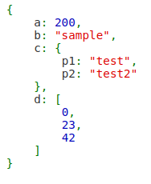

# php-humanize-json
Custom PHP function to pretty print json strings / json objects for easier human readibility.

Incorporates code from php.net user comment: http://php.net/manual/en/function.highlight-string.php#118550

Sample:

`{"a": 200, "b": "sample", "c": {"p1": "test", "p2": "test2"}, "d": [0, 23, 42]}`

is transformed to:

